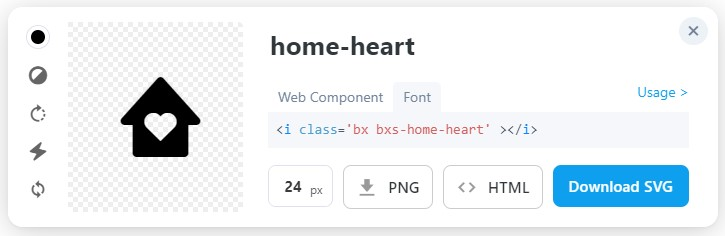

<html>
<body>
<h2>CS4SG@UB</h2>
The official website for UB's Computer Science for Social Good.

<h3>Link to the Website:</h3>
<a href = "https://cs4sg.github.io/" target="_blank">https://cs4sg.github.io/</a>
<br>
<i>For website related concerns, you can reach out to: <a href="mailto:cse-webmaster@buffalo.edu">cse-webmaster@buffalo.edu</a></i>
</ul>

### Table of Contents:
1. Adding a Page
2. Adding a Research Project Page
3. Credits & Content Information

### Adding a Page
*E.g. Education, Research Speakers*
1. Create an html or markdown file.
2. Add front matter (file MUST start with front matter):
    ```HTML
    ---
    layout: default
    title: Research
    ---
    
    Page content goes here.
    ```
    -Front matter is a list of variables for the page.\
    -MUST put three dashes `---` on the lines before and after the variables.\
    -`layout: default` adds header, footer, css, jss, imgs, etc to your file. Just copy it as written.\
    -Replace "Research" in `title: Research` with your desired title.
3. Write the contents of your page in html or markdown or both BELOW the front matter.
4. Save the page with a filename ending in .html or .md.
5. Upload your file to the root directory (like index.html and research.md).

### Adding a Research Project Page
*E.g. Bias in NLP, FAI - will show up with a short description on the Research page with a link directing to the rest of the project page's contents.*
1. Create an html or markdown file.
2. Add front matter in the same way as adding a new page (above), but with a few more variables:
    ```HTML
    ---
    layout: default
    title: FAI
    description: <ul><li>Details</li><li>People</li><li>Values and Ethics Statement</li></ul>
    icon: <i class='bx bxs-home-heart' ></i>
    ---

    Page content goes here.
    ```
    -Copy `layout: default`.\
    -Write your desired title after `title: `.\
    -Write your desired description after `description: `.\
    -Optional: Include an icon from [BoxIcons](https://boxicons.com/).
        Click the "Font" option for your chosen icon to get it in the appropriate format.\
        
3. Write the contents of the project (which will appear as its own page when the name link is clicked) BELOW the front matter.
4. Save the page with a filename ending in .html or .md.
5. Upload your file inside the \_research_projects folder.

<h3>Credits</h3>

<h4>Creators</h4>
<ul><li>Prakshal Jain</li>
<li>Hope Kara</li></ul>

<h4>Theme</h4>
This website is inherited from Squadfree Template by bootstrap.<br>
<b>More Info:</b><br>
Template Name: Squadfree<br>
Template URL: <a href = "https://bootstrapmade.com/squadfree-free-bootstrap-template-creative/" target = "_blank">https://bootstrapmade.com/squadfree-free-bootstrap-template-creative/</a><br>
Author: BootstrapMade.com<br>

<b>License: </b><a href = "https://bootstrapmade.com/license/" target = "_blank">https://bootstrapmade.com/license/</a><br>

<h4><b>Content Information</b><br></h4>
<ul>
<li>Icons Used: Boxicons (<a href = "https://boxicons.com/" target = "_blank">https://boxicons.com/</a>)</li>
<li>Fonts Used:<ol><li><a href = "https://cdnjs.cloudflare.com/ajax/libs/font-awesome/4.7.0/css/font-awesome.min.css" target = "_blank">https://cdnjs.cloudflare.com/ajax/libs/font-awesome/4.7.0/css/font-awesome.min.css</a><br>
</li><li><a href = "https://fonts.googleapis.com/css?family=Open+Sans:300,300i,400,400i,600,600i,700,700i|Raleway:300,300i,400,400i,500,500i,600,600i,700,700i|Poppins:300,300i,400,400i,500,500i,600,600i,700,700i" target = "_blank">https://fonts.googleapis.com/css?family=Open+Sans:300,300i,400,400i,600,600i,700,700i|Raleway:300,300i,400,400i,500,500i,600,600i,700,700i|Poppins:300,300i,400,400i,500,500i,600,600i,700,700i</a></li></ol>
  </li>
<li> Color Palette:<ol><li>#67b0d1 <i>(Logo Color)</i></li><li>#2f4d5a <i>(Font Color in white background)</i></li><li>rgba(255, 255, 255, 0.75) <i>(Font color in dark background)</i></li><li>#8ec4dd <i>(Link Color)</i></li></ol></li>
</ul>

<!--A sample layout page for the website is provided here: <a href = "https://github.com/CS4SG/CS4SG.github.io/blob/master/sample_page.html">https://github.com/CS4SG/CS4SG.github.io/blob/master/sample_page.html</a> -->
</body>
</html>
